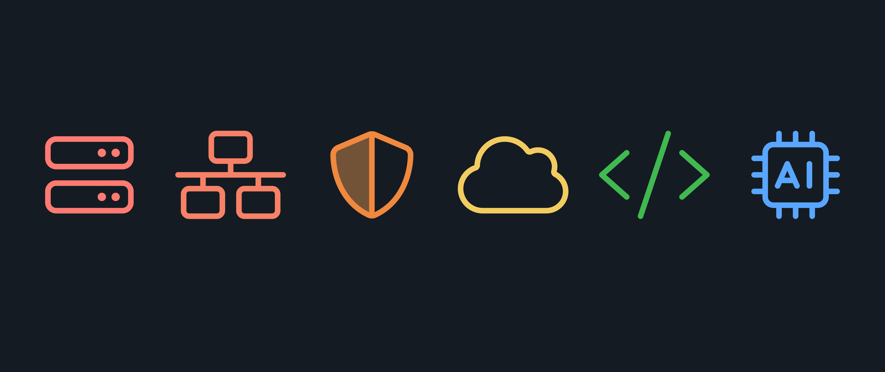

<h1>
  Information Technology Bootcamp Pre-Work
  The Life of an IT Professional
</h1>

## What is Information Technology?

Information Technology (IT) is the use of computers to securely store, retrieve, transmit, and manipulate data or information. If that sounds broad or far-reaching, that's because it is! IT is a vast field encompassing many different roles and responsibilities with a considerable impact on the way we live and work. This drives the demand for IT professionals across all industries.

## What does an IT professional do?

IT professionals support the technology that organizations and individuals rely on. This means that IT professionals can be involved in a wide range of tasks, including:

- Setting up, maintaining, and troubleshooting hardware.
- Installing, updating, configuring, and maintaining software including operating systems, productivity software, and specialized applications.
- Deploying, managing, and securing networks, including ensuring the network can handle the traffic it receives.
- Protecting systems, networks, and programs from digital and physical attacks.
- Ensuring business continuity and planning for disasters by taking actions such as automatically backing up data so systems can be recovered after experiencing failures.
- Storing and transmitting data securely and allowing data to be retrieved by authorized users when needed.

This is just a tiny sample of the specific tasks that IT professionals can be responsible for. The specific tasks a worker might have will depend on their role, the organization they work for, and the industry they work in.

## IT domains and competencies

Typically, IT workers who have been in the industry long enough will specialize in a particular domain, such as network administration, cybersecurity, or cloud computing. However, almost all IT professionals need to have a solid understanding of hardware, software, networking, and security fundamentals before going down a specialized path.

Let's explore some of the most common domains and a few required skills to succeed in each. Note that this is not an exhaustive list of either domains or abilities.

### System administration

System administration is the management of IT systems, including servers and devices.

- Managing operating systems (OSs).
- Maintaining IT infrastructure such as workstations and servers.
- Implementing virtualization and cloud computing.
- Automating routine tasks using scripting languages.

### Network administration

Network administration is the management of an organization's network infrastructure.

- Designing and implementing network architecture.
- Monitoring and optimizing network performance.
- Troubleshooting network issues.
- Securing network infrastructure.

### Cybersecurity

Broadly, cybersecurity is the protection of IT infrastructure and data from attacks.

- Identifying and mitigating security risks.
- Monitoring and responding to security incidents.
- Ensuring compliance with industry standards and regulations.
- Developing security policies and procedures.

### Cloud computing

Cloud computing involves delivering computing services over the internet from a data center or other remote location.

- Managing cloud platforms and services.
- Designing and implementing cloud-based solutions.
- Monitoring and optimizing cloud resources.
- Ensuring data security and compliance in the cloud.

### DevOps

DevOps is a set of practices that combines software development (Dev) and IT operations (Ops).

- Automating the deployment and configuration of software.
- Aligning IT operations with business needs.
- Streamlining IT workflows and processes.
- Implementing monitoring and alerting systems.

### Emerging technologies

Emerging technologies are in their infancy or will enter the mass market within the next few years.

- Exploring artificial intelligence (AI) and machine learning (ML) applications.
- Evaluating blockchain and distributed systems.
- Quantum computing.
- Researching how organizations can apply new technologies to solve business problems.

## T-shaped skills

Domain experts in IT are often referred to as having *T-shaped skills*. This refers to the idea that as they progress in their careers. Mid-to-late career IT professionals generally have a broad understanding of IT concepts and technologies (the horizontal bar of the T) and a deep understanding of a specific domain or technology (the vertical bar of the T).

For example, a network administrator might have a deep understanding of networking concepts and technologies and a broad understanding of other IT domains, such as cybersecurity and system administration, to more effectively collaborate with other domain experts.

  <h2 class="title">Think through your career path</h2>
  5 min

Based on what you know about IT right now, are there any domains you're particularly interested in? You don't have to commit to anything today, but thinking about what you might want to specialize in can help you start to set long-term goals for your career and help you decide what skills you might want to focus on developing.

Don't worry if you're not sure what you may want to specialize in yet - it's expected to take some time to figure that out, and you'll start to explore many of these domains in detail as you progress through the course. Don't be surprised if you change your mind a few times along the way!
