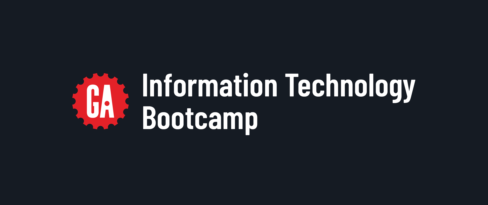

<h1>
  Information Technology Bootcamp Pre-Work
  Welcome to General Assembly!
</h1>

We're thrilled you are joining us for the Information Technology Bootcamp (ITB)! Before you embark on your in-course journey, we'd like to get you better acclimated to life as a student at General Assembly. We've designed this pre-work to help you prepare for a successful cohort experience and make your transition into student life as smooth and enjoyable as possible.

## Why is this pre-work important?

This pre-work was designed primarily by gathering feedback from instructors teaching GA courses and students who have taken them. That feedback led us to create this pre-work so that you have the information past students wish they had known before starting the course. Your instructors will also appreciate you being familiar with some basics when you show up for the first day.

We think this information is so important that we require all students to complete pre-work before starting any bootcamp course.

Don't worry; we won't take up too much of your time. This pre-work will take about five hours to complete, and you'll spend a good portion of that installing software and setting up your device.

> 😎 We'll expect you to have a basic understanding of everything covered in the pre-work before day one of the course, but we won't expect you to be an expert.

## What can I expect when taking a course at General Assembly?

GA designs courses to be intense and challenging but also rewarding. While in class, we expect you to be present, engaged, and ready to learn. Treat this experience as an opportunity to invest in yourself and your future to get the most out of the course. As an adult learner, we expect you to take responsibility for your learning and proactively seek help when you need it.

You'll work and learn alongside a diverse blend of people from various disciplines who share similar goals as yourself. Your peers are one of your greatest resources while you're in your cohort and as you progress in your career. You may even make life-long friends. Be ready to collaborate with them in the professional education environment we've created for you.

## What can I expect in ITB?

We've primarily designed ITB for individuals with minimal experience in tech who want the skills, experience, and confidence to start a successful career as an IT professional.

The course prepares you to take the CompTIA A+ Core 1 (220-1101), A+ Core 2 (220-1102), and Network+ (N10-009) exams to become A+ and Network+ certified. These industry-recognized credentials prove you have a strong foundation in computer technology, networking, and essential professional skills.

We recognize that your end goal isn't just to be cert-ready but to land your first job working with tech. So, in addition to preparing to take the certification exams, you'll also learn the skills and tools you need to be successful in an IT role. You'll get experience with and work with tools such as the command line, Git, Docker, Python, and more. You'll also learn how to work in a professional environment by honing skills to communicate effectively, work on a team, and manage your time.

  <h2 class="title">Reflect on your career change</h2>
  10 min

This exercise may be uncomfortable, but we're going to pause here so you can reflect on your career change. Don't worry; you don't have to share your thoughts with anyone else. This is just for you.

Sometimes, the challenges of ITB will be intense, and you might be tempted to give up - it's not called a bootcamp for nothing. In these moments, it's important to remember why you started this journey. Take a few minutes to reflect on your motivation for enrolling in this course and what you hope to achieve by completing ITB. Feel free to write down your thoughts so you can refer back to them when you need a reminder of why you're here.

Based on what you know about IT, consider the aspects that naturally draw your interest and where your strengths might align with the skills required in this field. What are the things you feel you'll excel at? Again, you might want to write down your thoughts if you're having a bad day and need to remind yourself of why you decided to pursue IT in the first place.
